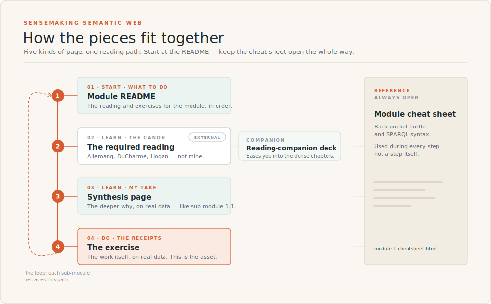

# Sensemaking Semantic Web

> A 12-week self-directed curriculum through RDF, OWL, SPARQL, and modern knowledge graphs — worked in public, with every artifact open.

**Status:** 🟢 Launched · Module 1 begins 5/31/2026

---

## About this curriculum

This repository is the canonical record of a self-directed learning project: working through the semantic web stack from foundations to a deployed hybrid LLM + knowledge graph application.

It's published openly under **Sensemaking AI**, an independent AI/ML consulting practice. Sensemaking AI is run by [Barbara Hidalgo-Sotelo](https://www.linkedin.com/in/barbara-hidalgo-sotelo/) — this curriculum is her work, published transparently under her consulting brand. No fake team, no corporate scaffolding. One practitioner working through the material in public, with the receipts in this repo.

This is not a cohort course or paid enrollment. It's a learning journey published in public — the materials are designed to be usable, but there's no instructor, no cohort, and no support contract. You're welcome to follow along, fork the repo, run the exercises yourself, or use it as a roadmap for your own self-directed path.

---

## The arc

| Module | Theme | Weeks | Status |
|---|---|---|---|
| [1](./modules/01-foundations/) | Foundations: RDF, Turtle, basic SPARQL | 1-3 | In progress |
| [2](./modules/02-modeling/) | Modeling: RDFS, OWL, ontology design | 4-6 | Not started |
| [3](./modules/03-reasoning/) | Reasoning at the edge | 7-9 | Not started |
| [4](./modules/04-shipping/) | Shipping semantic systems | 10-12 | Not started |

Full details in **[SYLLABUS.md](./SYLLABUS.md)**. Live progress in **[PROGRESS.md](./PROGRESS.md)**.

---

## How to use this site

The curriculum has three kinds of readers and three matching paths through the material. Pick the one that fits.

<a href="https://curriculum.barbhs.com/map.html">
  
</a>

**New readers** start at this README, read the SYLLABUS for the arc, then go to the [Module 1 README](./modules/01-foundations/README.md) for the route selector — three paths through the module depending on whether you want the full conceptual foundation, a hands-on win first, or a portfolio artifact. Module READMEs are the operational layer: they orchestrate the readings, synthesis pages, workbooks, and project. Submodule HTML pages are synthesis essays that explain the conceptual moves in the author's voice rather than restating the canonical references.

**Drive-by readers** typically arrive from LinkedIn at a single submodule page. That's by design — each submodule is meant to stand alone as a synthesis essay. If something there is worth more time, the "what to do next" section on each submodule is the bridge back into the broader curriculum.

Practitioner lookups come for the reference layer: cheatsheets (back-pocket syntax), the glossary (term definitions), and the resources sidebar (annotated reading list, tools, public KGs). These are designed to be useful without context. If you've already worked through the curriculum and you're back for a refresh, this is your entry point.

---

## Repository structure

```
sensemaking-ai/semantic-web-curriculum/
├── README.md              # You are here
├── SYLLABUS.md            # The full curriculum document
├── PROGRESS.md            # Live progress tracker, updated weekly
├── REFLECTIONS.md         # Cross-module reflections (added as work progresses)
├── modules/
│   ├── 01-foundations/    # RDF, Turtle, basic SPARQL
│   ├── 02-modeling/       # RDFS, OWL, ontology design
│   ├── 03-reasoning/      # Inference, reification, SHACL
│   └── 04-shipping/       # SPARQL UPDATE, deployment, LLM+KG
└── resources/
    ├── reading-list.md    # Books and primary sources
    ├── tools.md           # Software install notes
    └── public-kgs.md      # Wikidata, DBpedia, and other endpoints
```

Each module folder contains its own README, `exercises/`, `notes/` (weekly synthesis), and `artifacts/` (the published work or links to it).

---

## How to follow along

- **GitHub (here):** The official, canonical record. All commits dated. Watch the repo for notifications when new work lands.
- **LinkedIn:** [Twice-weekly progress posts](https://www.linkedin.com/in/barbara-hidalgo-sotelo/) — one short insight from the week's reading, one artifact-or-question.
- **sensemaking-ai.com:** End-of-module long-form posts. The deeper analysis, the design decisions, the "what I changed my mind about."
- **barbhs.com:** Occasional musings and explorations that don't fit elsewhere.

<a href="https://curriculum.barbhs.com/map.html">
  
</a>


---

## The anchoring projects

Two existing projects are the canvases for this curriculum:

**[Naruto Network Graph](https://docs.barbhs.com/naruto-network-graph/)** is the primary canvas. 87 characters, 3 narrative arcs (Chunin Exams, Sasuke Retrieval Mission, Pain's Assault), 36 hand-coded canonical relationships layered over subtitle-based co-appearance edges. The rich categorical structure of the Naruto universe — ninja ranks as a clean subclass hierarchy, villages as organizations, jutsu, contested fan canon — makes it an unusually good semantic-web testbed. Pop-culture domains are standard in ontology pedagogy (the Pizza ontology is the canonical Protégé tutorial) for exactly this reason.

**[Resume Graph Explorer](https://resume-graph-explorer.vercel.app/)** anchors Module 1 specifically. Its existing ESCO/SKOS integration is genuine semantic-web interop — that's where the case for RDF over a property graph is sharpest. It returns in Module 3 as a secondary venue for skill inference.

---

## Why publish learning openly

Three reasons:

1. **Forcing function.** Public commitments dramatically reduce stall rates. Knowing the work is visible turns "I should write notes" into "I have to ship notes."
2. **Compounding portfolio.** Each module produces real artifacts: published ontologies, evaluation notebooks, deployed demos. By the end, the curriculum *is* the portfolio.
3. **Showing the work matters.** Most learning artifacts you find online describe finished states. This one shows the process — including the redos, the failed exercises, and the wrong turns.

---

## Acknowledgments

This curriculum is shaped by and points repeatedly to the canonical reference materials in this field. None of the conceptual content here is original; the contribution is the path through it.

- **Allemang, Hendler & Gandon** — *Semantic Web for the Working Ontologist* (3rd ed., ACM Books 2020). Companion site: [workingontologist.org](https://workingontologist.org/)
- **DuCharme** — *Learning SPARQL* (2nd ed., O'Reilly 2013). Examples and sample data: [learningsparql.com](https://www.learningsparql.com/) · Active blog: [bobdc.com](https://www.bobdc.com/blog/)
- **Hogan et al.** — *Knowledge Graphs* (Synthesis Lectures, 2021). Open access: [kgbook.org](https://kgbook.org/)
- **Heath & Bizer** — *Linked Data: Evolving the Web into a Global Data Space*. Open access: [linkeddatabook.com](http://linkeddatabook.com/editions/1.0/)
- **W3C specifications** — the primary sources. See [resources/reading-list.md](./resources/reading-list.md) for the full bookmarks set.

---

## License

- **Code, exercises, configurations:** MIT
- **Written content (syllabus, notes, blog posts):** CC BY 4.0

You're welcome to reuse, adapt, and remix any of it — just attribute.

---

## Contact

Barbara Hidalgo-Sotelo · Sensemaking AI · Austin, TX

[LinkedIn](https://www.linkedin.com/in/barbara-hidalgo-sotelo/) · [sensemaking-ai.com](https://sensemaking-ai.com) · [barbhs.com](https://barbhs.com)

Questions, corrections, and discussion welcome via GitHub Issues. This is a personal learning project, so I'm not accepting pull requests on the curriculum itself, but I'd love to hear from anyone working through this material — including disagreements about the content choices.
